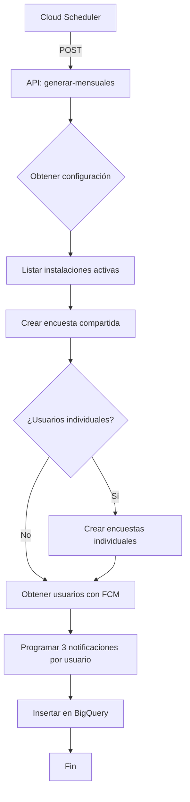
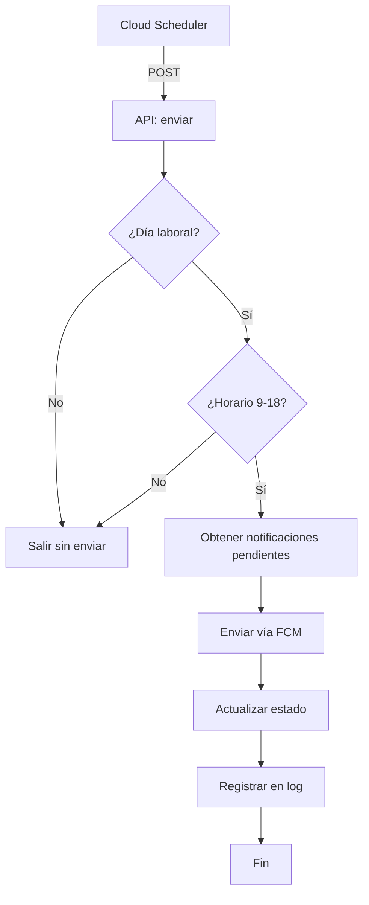

# 📋 WFSA Encuestas API

API FastAPI para la gestión automatizada de encuestas de satisfacción del servicio de seguridad.

## 📑 Tabla de Contenidos

- [Descripción](#descripción)
- [Arquitectura](#arquitectura)
- [Requisitos](#requisitos)
- [Instalación](#instalación)
- [Configuración](#configuración)
- [Uso Local](#uso-local)
- [Endpoints](#endpoints)
- [Despliegue en Cloud Run](#despliegue-en-cloud-run)
- [Automatización con Cloud Scheduler](#automatización-con-cloud-scheduler)
- [Base de Datos](#base-de-datos)
- [Flujo de Encuestas](#flujo-de-encuestas)
- [Notificaciones Push](#notificaciones-push)
- [Troubleshooting](#troubleshooting)

---

## 📖 Descripción

Esta API gestiona el ciclo completo de encuestas de satisfacción para instalaciones de seguridad:

- ✅ **Generación automática** de encuestas mensuales
- ✅ **Encuestas compartidas** (cualquier cliente puede responder)
- ✅ **Encuestas individuales** (para clientes específicos)
- ✅ **Notificaciones push** programadas (día 1, 15 y 25)
- ✅ **Restricción horaria** (Lunes-Viernes, 9:00-18:00)
- ✅ **Solo primera respuesta** válida para encuestas compartidas
- ✅ **9 preguntas** (8 con escala 1-5 + comentario, 1 texto libre)

---

## 🏗️ Arquitectura
┌─────────────────────────────────────────────────────────────┐
│ Cloud Scheduler │
│ ┌───────────────────┐ ┌──────────────────┐ │
│ │ Generar Encuestas │ │ Enviar Push │ │
│ │ (Día 1 - 00:01) │ │ (Diario - 10:00) │ │
│ └─────────┬─────────┘ └────────┬─────────┘ │
└────────────┼──────────────────────────┼────────────────────┘
│ │
│ HTTP POST │ HTTP POST
▼ ▼
┌────────────────────────────────────────────┐
│ FastAPI Encuestas API │
│ ┌──────────────┐ ┌──────────────────┐ │
│ │ Generar │ │ Enviar │ │
│ │ Encuestas │ │ Notificaciones │ │
│ └──────┬───────┘ └────────┬─────────┘ │
└─────────┼──────────────────────┼────────────┘
│ │
│ BigQuery Insert │ FCM API
▼ ▼
┌─────────────────┐ ┌──────────────────┐
│ BigQuery │ │ Firebase Cloud │
│ (Encuestas) │ │ Messaging (FCM) │
└─────────────────┘ └──────────────────┘


---

## ⚙️ Requisitos

- **Python** 3.11+
- **Google Cloud Project** con:
  - BigQuery API habilitada
  - Firebase Cloud Messaging (FCM) configurado
  - Service Account con permisos
- **Cuenta de servicio** con roles:
  - `BigQuery Data Editor`
  - `BigQuery Job User`
  - `Firebase Cloud Messaging Admin`

---

## 📦 Instalación

### 1. Clonar/Crear el proyecto

```bash
mkdir API_Encuestas
cd API_Encuestas
```

### 2. Crear estructura de archivos
API_Encuestas/
├── main.py
├── requirements.txt
├── .env
├── Dockerfile (opcional)
└── README.mdción

### 1. Variables de entorno (`.env`)

```env
# Google Cloud
GOOGLE_APPLICATION_CREDENTIALS=ruta/a/tu/service-account.json
PROJECT_ID=worldwide-470917
DATASET=app_clientes

# API
PORT=8001
```

### 2. Configurar credenciales de Google Cloud

**Opción A: Variable de entorno**
```bash
export GOOGLE_APPLICATION_CREDENTIALS="C:\ruta\a\service-account.json"
```

**Opción B: En Windows (PowerShell)**
```powershell
$env:GOOGLE_APPLICATION_CREDENTIALS="C:\ruta\a\service-account.json"
```

### 3. Verificar tablas en BigQuery

Asegúrate de que existan estas tablas en `app_clientes`:

- ✅ `encuestas_configuracion`
- ✅ `encuestas_preguntas`
- ✅ `encuestas_solicitudes`
- ✅ `encuestas_respuestas`
- ✅ `encuestas_notificaciones_programadas`
- ✅ `encuestas_notificaciones_log`
- ✅ `usuario_instalaciones` (con campo `requiere_encuesta_individual`)
- ✅ `usuarios_app` (con campo `fcm_token`)

---

## 🚀 Uso Local

### Ejecutar el servidor

```bash
# Opción 1: Con Python
python main.py

# Opción 2: Con Uvicorn
uvicorn main:app --reload --port 8001
```

El servidor estará disponible en:
- **API**: http://localhost:8001
- **Documentación Swagger**: http://localhost:8001/docs
- **Documentación ReDoc**: http://localhost:8001/redoc

---

## 📡 Endpoints

### 1. **Health Check**

```http
GET /health
```

**Respuesta:**
```json
{
  "status": "healthy"
}
```

---

### 2. **Generar Encuestas Mensuales**

```http
POST /api/encuestas/generar-mensuales
```

**Descripción:**
- Genera encuestas para todas las instalaciones activas
- Crea encuestas compartidas + individuales según configuración
- Programa notificaciones push automáticas

**Respuesta exitosa:**
```json
{
  "success": true,
  "periodo": "202410",
  "encuestas_creadas": 150,
  "notificaciones_programadas": 450
}
```

**Proceso:**
1. Lee configuración activa
2. Obtiene instalaciones activas
3. Crea 1 encuesta compartida por instalación
4. Crea encuestas individuales para usuarios marcados
5. Programa 3 notificaciones por encuesta (día 1, 15, 25)

---

### 3. **Enviar Notificaciones Push**

```http
POST /api/notificaciones/enviar
```

**Descripción:**
- Envía notificaciones push pendientes
- Verifica horario permitido (L-V, 9:00-18:00)
- Actualiza estado y registra logs

**Respuesta exitosa:**
```json
{
  "success": true,
  "enviadas": 45,
  "fallidas": 2,
  "total": 47
}
```

**Restricciones:**
- ⏰ Solo Lunes-Viernes
- 🕘 Solo 9:00 - 18:00 hrs
- 📊 Máximo 100 notificaciones por ejecución

---

## ☁️ Despliegue en Cloud Run

### 1. Construir y desplegar

```bash
gcloud run deploy encuestas-api \
  --source . \
  --region us-central1 \
  --allow-unauthenticated \
  --set-env-vars PROJECT_ID=worldwide-470917,DATASET=app_clientes \
  --memory 512Mi \
  --timeout 300s
```

### 2. Obtener URL del servicio

```bash
gcloud run services describe encuestas-api \
  --region us-central1 \
  --format 'value(status.url)'
```

### 3. Probar el servicio

```bash
curl https://TU_URL_CLOUD_RUN/health
```

---

## ⏰ Automatización con Cloud Scheduler

### 1. Crear job para generar encuestas (día 1 de cada mes)

```bash
gcloud scheduler jobs create http generar-encuestas-mensuales \
  --location us-central1 \
  --schedule "1 0 1 * *" \
  --uri "https://TU_URL_CLOUD_RUN/api/encuestas/generar-mensuales" \
  --http-method POST \
  --time-zone "America/Santiago" \
  --description "Genera encuestas el día 1 de cada mes a las 00:01"
```

### 2. Crear job para enviar notificaciones (diariamente)

```bash
gcloud scheduler jobs create http enviar-notificaciones-push \
  --location us-central1 \
  --schedule "0 10 * * *" \
  --uri "https://TU_URL_CLOUD_RUN/api/notificaciones/enviar" \
  --http-method POST \
  --time-zone "America/Santiago" \
  --description "Envía notificaciones push diariamente a las 10:00"
```

### 3. Verificar jobs creados

```bash
gcloud scheduler jobs list --location us-central1
```

### 4. Ejecutar manualmente (para probar)

```bash
# Generar encuestas
gcloud scheduler jobs run generar-encuestas-mensuales --location us-central1

# Enviar notificaciones
gcloud scheduler jobs run enviar-notificaciones-push --location us-central1
```

---

## 🗄️ Base de Datos

### Configuración de Encuestas (`encuestas_configuracion`)

| Campo | Tipo | Descripción |
|-------|------|-------------|
| `id` | STRING | ID único de configuración |
| `periodicidad_dias` | INT64 | Días entre encuestas (30 = mensual) |
| `dia_generacion` | INT64 | Día del mes para generar (1 = día 1) |
| `dias_para_responder` | INT64 | Días límite para responder (30) |
| `dia_recordatorio_1` | INT64 | Día del primer recordatorio (15) |
| `dia_recordatorio_2` | INT64 | Día del segundo recordatorio (25) |
| `notificaciones_activas` | BOOL | Si enviar notificaciones push |
| `horario_inicio` | INT64 | Hora inicio notificaciones (9) |
| `horario_fin` | INT64 | Hora fin notificaciones (18) |
| `dias_laborales` | ARRAY<INT64> | Días permitidos [1,2,3,4,5] |
| `activo` | BOOL | Si configuración está activa |

### Solicitudes de Encuestas (`encuestas_solicitudes`)

| Campo | Tipo | Descripción |
|-------|------|-------------|
| `encuesta_id` | STRING | UUID único |
| `periodo` | STRING | YYYYMM (ej: "202410") |
| `cliente_rol` | STRING | Código del cliente |
| `instalacion_rol` | STRING | Código de instalación |
| `modo` | STRING | "compartida" o "individual" |
| `email_destinatario` | STRING | Email (null si compartida) |
| `estado` | STRING | "pendiente", "completada", "vencida" |
| `fecha_creacion` | TIMESTAMP | Cuándo se creó |
| `fecha_limite` | TIMESTAMP | Fecha máxima para responder |
| `respondido_por_email` | STRING | Quién respondió |
| `fecha_respuesta` | TIMESTAMP | Cuándo se respondió |

---

## 🔄 Flujo de Encuestas

### 1. Generación (Día 1 de cada mes - 00:01)



### 2. Envío de Notificaciones (Diario - 10:00)



---

## 📱 Notificaciones Push

### Timeline de Notificaciones

Para una encuesta generada el **1 de octubre**:

| Día | Tipo | Título | Hora |
|-----|------|--------|------|
| **1** | Nueva | 📋 Nueva Encuesta Disponible | 09:00 |
| **15** | Recordatorio 1 | 🔔 Recordatorio de Encuesta | 09:00 |
| **25** | Recordatorio 2 | ⚠️ Último Recordatorio | 09:00 |
| **31** | - | *(Encuesta vence)* | 23:59 |

### Payload FCM

```json
{
  "message": {
    "token": "fcm_token_del_usuario",
    "notification": {
      "title": "📋 Nueva Encuesta Disponible",
      "body": "Tiene una nueva encuesta de satisfacción para INACAP MAIPU"
    },
    "data": {
      "encuesta_id": "uuid-de-la-encuesta",
      "tipo": "nueva"
    },
    "android": {
      "priority": "high"
    }
  }
}
```

---

## 🐛 Troubleshooting

### Error: "No hay configuración activa"

**Solución:** Insertar configuración en BigQuery:

```sql
INSERT INTO `worldwide-470917.app_clientes.encuestas_configuracion`
(id, periodicidad_dias, dia_generacion, dias_para_responder, 
 dia_recordatorio_1, dia_recordatorio_2, notificaciones_activas,
 horario_inicio, horario_fin, dias_laborales, activo, fecha_actualizacion)
VALUES
('config_001', 30, 1, 30, 15, 25, TRUE, 9, 18, [1,2,3,4,5], TRUE, CURRENT_TIMESTAMP());
```

### Error: "Could not automatically determine credentials"

**Solución:** Configurar variable de entorno:

```bash
export GOOGLE_APPLICATION_CREDENTIALS="/ruta/a/service-account.json"
```

### Notificaciones no se envían

**Verificar:**
1. ✅ `notificaciones_activas = TRUE` en configuración
2. ✅ Usuarios tienen `fcm_token` válido
3. ✅ Es día laboral (Lunes-Viernes)
4. ✅ Es horario 9:00-18:00
5. ✅ `fecha_programada` <= fecha actual

### Encuestas duplicadas

**Solución:** Verificar que Cloud Scheduler no se ejecute múltiples veces:

```bash
gcloud scheduler jobs describe generar-encuestas-mensuales --location us-central1
```

---

## 📊 Monitoreo

### Logs en Cloud Run

```bash
gcloud run logs read encuestas-api --region us-central1 --limit 50
```

### Verificar encuestas generadas

```sql
SELECT periodo, COUNT(*) as total
FROM `worldwide-470917.app_clientes.encuestas_solicitudes`
GROUP BY periodo
ORDER BY periodo DESC;
```

### Verificar notificaciones enviadas

```sql
SELECT 
  DATE(fecha_envio) as fecha,
  estado,
  COUNT(*) as total
FROM `worldwide-470917.app_clientes.encuestas_notificaciones_log`
GROUP BY fecha, estado
ORDER BY fecha DESC;
```

---

## 🔐 Seguridad

### Recomendaciones

1. ✅ **Usar service account** con permisos mínimos necesarios
2. ✅ **No exponer** credenciales en el código
3. ✅ **Usar variables de entorno** para configuración sensible
4. ✅ **Habilitar autenticación** en Cloud Run (en producción)
5. ✅ **Configurar VPC** si necesitas acceso privado a BigQuery

### Permisos necesarios de Service Account

```bash
# BigQuery
roles/bigquery.dataEditor
roles/bigquery.jobUser

# Firebase
roles/firebase.admin

# Cloud Run (si usa autenticación)
roles/run.invoker
```

---

## 📞 Soporte

Para dudas o problemas:
- **Proyecto:** WFSA App - Módulo Encuestas
- **Versión:** 1.0.0
- **Última actualización:** Octubre 2024

---

## 📝 Changelog

### v1.0.0 (2024-10-16)
- ✅ Generación automática de encuestas mensuales
- ✅ Encuestas compartidas e individuales
- ✅ Sistema de notificaciones push
- ✅ Restricción horaria configurable
- ✅ Logs y auditoría completa

---

## 🚀 Próximas Mejoras

- [ ] Endpoint para consultar encuestas activas por usuario
- [ ] Endpoint para enviar respuestas de encuestas
- [ ] Dashboard de estadísticas
- [ ] Exportar resultados a PDF/Excel
- [ ] Notificaciones por email (además de push)
- [ ] Configuración multi-tenant por cliente

---

**¡La API está lista para producción!** 🎉